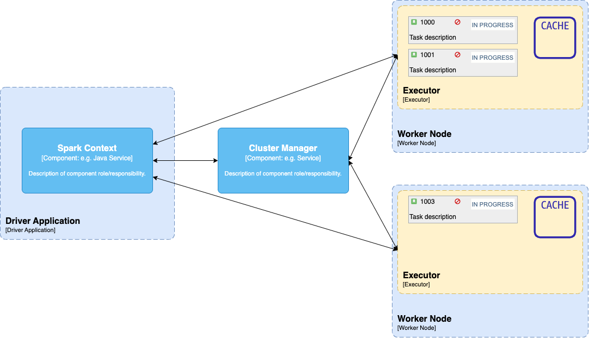

# Apache Spark Java

## What is Apache Spark?

Apache Spark is a computational engine that can schedule and distribute an application computation consisting of many
tasks.
Meaning your computation tasks or application won’t execute sequentially on a single machine.
Instead, Apache Spark will split the computation into separate smaller tasks and run them in different servers within
the cluster.
Therefore, maximizing the power of parallelism.

> Another critical improvement over Hadoop is speed. Using in-memory storage for intermediate computation results makes
> Apache Spark much faster than Hadoop MapReduce.

## Spark Architecture



Apache Spark uses a master-slave architecture, meaning one node coordinates the computations that will execute in the
other nodes.

At a high level, every Spark application consists of a driver program that runs the user’s main function and executes various parallel operations on a cluster.

### Abstraction Level 1
The main abstraction Spark provides is a resilient distributed dataset (RDD), which is a collection of elements partitioned across the nodes of the cluster that can be operated on in parallel.
RDDs are created by starting with a file in the Hadoop file system (or any other Hadoop-supported file system), or an existing Scala collection in the driver program, and transforming it.
Users may also ask Spark to persist an RDD in memory, allowing it to be reused efficiently across parallel operations.
Finally, RDDs automatically recover from node failures.

### Abstraction Level 2
A second abstraction in Spark is shared variables that can be used in parallel operations.
By default, when Spark runs a function in parallel as a set of tasks on different nodes, it ships a copy of each variable used in the function to each task.
Sometimes, a variable needs to be shared across tasks, or between tasks and the driver program. Spark supports two types of shared variables:

* broadcast variables, which can be used to cache a value in memory on all nodes,
* and accumulators, which are variables that are only “added” to, such as counters and sums.

### Master Node

.. is the central coordinator which will run the driver program.

### Worker Node

The worker node is a slave node
Its role is to run the application code in the cluster.

### Driver Program

.. will split a Spark job is smaller tasks and execute them across many distributed workers.
The driver program will communicate with the distributed worker nodes through a SparkSession.

### Cluster Manager

The role of the cluster manager is to allocate resources across applications.
The Spark is capable enough of running on a large number of clusters.
It consists of various types of cluster managers such as
* Hadoop YARN,
* Apache Mesos
* and Standalone Scheduler.
Here, the Standalone Scheduler is a standalone spark cluster manager that facilitates to install Spark on an empty set of machines.

### Executor

An executor is a process launched for an application on a worker node.
It runs tasks and keeps data in memory or disk storage across them.
It read and write data to the external sources.
Every application contains its executor.

### Task
A unit of work that will be sent to one executor.

## Set Up

There are ways to install and execute a Spark application using different configurations. You could configure Spark to
run the driver program and executor

* in the same single JVM in a laptop,
* different JVMs,
* or different JVMs across a cluster

In this tutorial, we will see the local configuration, which means, as mentioned before, the driver program, spark
executors, and cluster manager will run all in the same JVM.

### Prerequisites

We will need to check we have installed Java, version 8 or higher, and Maven on your machine.

### Linking with Spark

We will need to include the Spark dependency in your project to get access to the Spark functionality

```
<dependency>
  <groupId>org.apache.spark</groupId>
  <artifactId>spark-core_2.12</artifactId>
  <version>3.0.1</version>
</dependency>
```

### Write an Apache Spark Program

And finally, we arrive at the last step of the Apache Spark Java Tutorial, writing the code of the Apache Spark Java
program.
So far, we create the project and download a dataset, so we are ready to write a spark program that analyses this data.
Specifically, we will find out the most frequently used words in trending youtube titles.

To create the Spark application, I will make a class called YoutubeTitleWordCount and add our code within the main
method. Our code will carry out the following steps:

Create a Spark Context, which is the entry point to the Spark core functionality.
Loading the dataset as an RDD. The RDD is a Spark Core abstraction for working with data.
Running some transformation, extract all titles, remove the rest of fields, lower case and remove any punctuation from
the titles, and split them into words.
Counting the word occurrences, sort them, and print them.

```
// Create Spark Session
var spark = SparkSession
        .builder()
        .appName("microtema")
        .master("local")
        .getOrCreate();

// Create SPark Context
try (var jsc = new JavaSparkContext(spark.sparkContext())) {

    // Load Data
    var entries = jsc.textFile("src/main/resources/videos.csv");

    // Transforming data
    var titles = entries
            .map(Application::extractTitle)
            .filter(StringUtils::isNotBlank);

    var words = titles
            .flatMap(Application::splitWords)
            .filter(StringUtils::isNotBlank);

    // Counting data
    var wordCounts = words.countByValue();
    var sorted = wordCounts.entrySet().stream().sorted(Map.Entry.comparingByValue()).collect(Collectors.toList());

    // Display data
    sorted.forEach(it -> System.out.println(it.getKey() + ": " + it.getValue()));
}
```

## Glossary

| Term | Description                   |
|------|-------------------------------|
| RDD  | resilient distributed dataset |
